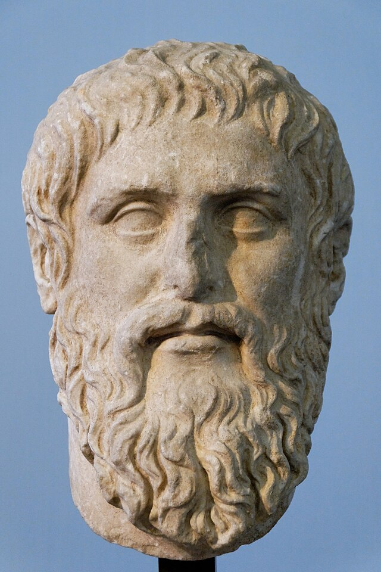
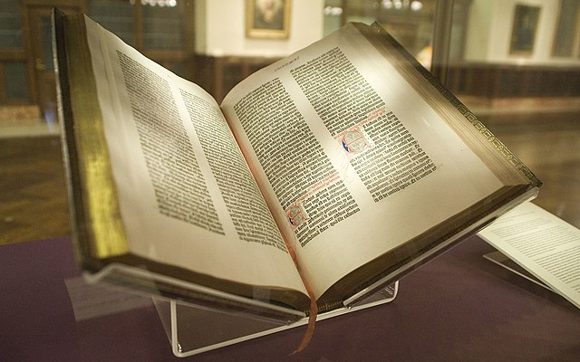
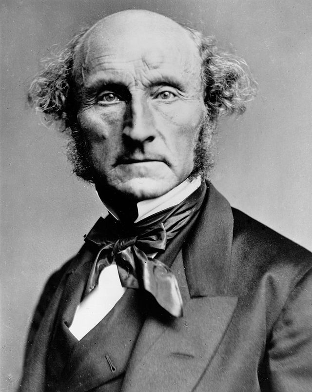

# Chapter 01: A Short History of IT Ethics

## Learning Outcomes

::: {.learning-outcomes}
By the end of this chapter, readers will be able to:

- Explain why IT ethics debates did not begin with modern AI.
- Compare optimistic and pessimistic arguments across major IT revolutions.
- Identify key historical thinkers and connect their ideas to current platform and AI issues.
- Analyze recurring patterns of liberation, control, and power in communication technologies.
- Articulate a historically informed position on contemporary AI governance.
:::

## Essential Question

::: {.essential-question}
What does the history of information technology teach us about the ethical challenges of AI today?
:::

## Section 1: What counts as an information technology revolution?

::: {.section-question}
Question: Why treat writing, printing, telegraphy, mass media, and the web as one ethical story?
:::

In 1450, making a single copy of the Bible took a monk roughly two years of full-time work. By 1500, printing presses had produced more than ten million books across Europe---more than all the manuscripts produced in the previous thousand years combined. That is an information technology revolution: not just a new tool, but a shift so large it changes who knows what, who controls knowledge, and who benefits or suffers as a result.

**Information technology** is any system used to create, store, transmit, retrieve, or process information at scale. By that definition, cuneiform clay tablets, the printing press, the telegraph, radio, the internet, and large language models all belong to the same story. Each one was greeted with excitement and fear. Each one genuinely changed society---for better and worse, and not equally for everyone.

Understanding this history matters because of a trap called **technological exceptionalism**: the belief that whatever technology exists *right now* is so new and powerful that nothing from the past applies. People said this about printing. They said it about the railroad, the telephone, the atomic bomb, and the internet. They are saying it again about AI. Sometimes the newness is real; more often, the ethical structure of the problem---who gains power, who gets hurt, who decides---looks remarkably familiar.

The opposite trap is **technological repetition**: assuming that because we have seen this before, nothing is genuinely different this time. That is also wrong. AI generates text, images, and audio indistinguishable from human work, at zero marginal cost, faster than any correction mechanism can keep up with. The specific risks require specific responses.

The most useful framing is a cycle that repeats across revolutions [@eisenstein1979printing; @postman1992technopoly]:

1. A new medium arrives with a narrative of liberation---*knowledge for everyone, connection across borders.*
2. The medium spreads rapidly, rewiring institutions faster than they can adapt.
3. Second-order harms appear, usually hitting the most vulnerable people first.
4. Society eventually responds: new laws, new norms, new institutions.

That cycle does not mean every revolution is the same. It means the ethical questions rarely wait for the governance to catch up---and that "wait and see" is itself a choice with consequences.

Three warning signs tend to appear when an information technology is becoming ethically dangerous:

1. **Power asymmetry increases:** a small number of actors control who gets to speak and who gets to be heard.
2. **Epistemic friction declines:** it becomes easier to produce and spread false claims than to verify true ones.
3. **Governance lag widens:** legal and institutional safeguards trail years or decades behind technical deployment.

All three are active today. All three were active in 1455, when Gutenberg's press began operating in Mainz, Germany.

| IT Revolution | Approximate Period | What Changed | What Went Wrong |
|---|---|---|---|
| Writing | c. 3200 BCE onward | Laws, records, literature | Only elites could read or write |
| Printing press | c. 1450 onward | Science, Reformation, mass literacy | Religious wars, witch-hunt manuals, mass propaganda |
| Telegraph | 1840s onward | Global news, coordinated markets | Imperial control, news monopolies |
| Radio and TV | 1920s--1990s | Mass political participation | State propaganda, genocide incitement |
| Internet and AI | 1990s onward | Open publishing, global connection | Algorithmic manipulation, synthetic disinformation |

Table: Five information technology revolutions and their real-world consequences.

::: {.discussion-questions}
**Discussion**

1. Which of the five revolutions in the table feels most similar to AI in your own daily life? What is the parallel?
2. Is the most important ethical question about a technology *what it can do*, or *who controls it*?
:::

## Section 2: What did Socrates and Plato fear about writing?

::: {.section-question}
Question: Is writing a memory aid---or a technology that weakens the mind?
:::

Around 399 BCE, the city of Athens put **Socrates** on trial for corrupting the youth and dishonoring the gods. The charges were political, but the trial exposed a deeper tension: Socrates had spent his life arguing through dialogue---asking questions, pressing for reasons, refusing to accept what authorities said. He never wrote anything down. His student **Plato** wrote everything down, including Socrates' arguments about why writing might be dangerous.

<figure>
  
  <figcaption>Roman marble copy of a Greek bust of Plato, attributed to the sculptor Silanion (c. 370 BCE). Musei Capitolini, Rome. Public domain (Wikimedia Commons).</figcaption>
</figure>

::: {.famous-figure}
**Plato (c. 428–348 BCE)**

Plato was an Athenian philosopher, student of Socrates, and founder of the Academy---one of the earliest institutions of higher learning in the Western world. He wrote his philosophical work as dialogues, most featuring Socrates as the main speaker, which means we encounter Socrates' ideas only through Plato's presentation of them.

His relationship to writing was famously paradoxical: he used the very medium he distrusted to preserve Socrates' warning against it. Plato's central preoccupation was the difference between genuine knowledge (*episteme*) and mere opinion or appearance (*doxa*)---a distinction he thought writing tended to blur.

*Key works:* *Republic*, *Phaedrus*, *Meno*, *Symposium*, *Apology*

*Relevance to IT ethics:* Introduced the question of epistemic outsourcing---whether tools that make information more accessible also make the people who use them less capable of genuine reasoning. This question applies directly to search engines, AI writing assistants, and large language models.
:::

In Plato's dialogue the *Phaedrus*, Socrates tells a story about **Theuth**, the Egyptian god who invented writing, bringing his invention to **King Thamus** for approval. Theuth says writing will improve human memory and make people wiser. Thamus disagrees [@plato1997phaedrus]:

> You give your disciples not truth but the semblance of truth; they will be hearers of many things and will have learned nothing; they will appear to be omniscient and will generally know nothing.

The king's worry is not that writing is useless. It is that written text creates the *appearance* of knowledge without the substance. A student who has read the answer can sound informed without having wrestled with the question. Socrates calls this **epistemic outsourcing**---offloading thinking to an external system in a way that leaves the person less capable, not more.

This worry deserves to be taken seriously, not dismissed. Writing genuinely transformed memory and reasoning. Before widespread literacy, oral cultures trained memory intensively---Greek poets memorized the entire *Iliad* (roughly 15,000 lines). If you could look something up, why remember it? The technology changed what counted as educated.

::: {.argument}
**Argument: The Epistemic Outsourcing Argument**

**Standard Form:**

1. Any tool that allows a person to *appear* knowledgeable without gaining genuine understanding produces false epistemic confidence.
2. Writing (and analogously, search engines and AI summarizers) allows users to retrieve and report information without having reasoned through it.
3. A tool that reliably produces false epistemic confidence is educationally harmful---it substitutes the appearance of understanding for its substance.

∴ Writing, search engines, and AI summarizers risk being educationally harmful when used to substitute for reasoning rather than to enable it.

**Common Criticisms:**

- *Equivocation on "knowing":* Accurately retrieving and reporting information is a genuine cognitive achievement---Socrates conflates different kinds of epistemic good.
- *Memory is also a technology:* Oral cultures rely on trained memory, which is no more "natural" than writing. The argument proves too much by privileging one medium.
- *Scaffolding vs. substituting:* The same tool can support learning or replace it, depending on how it is used; harm lies in design and context, not in the tool itself.
- *Performative contradiction:* Plato preserved this anti-writing argument *in writing*, suggesting even he did not straightforwardly accept it.
:::

But Plato's argument cuts both ways, and he clearly knew it: he preserved Socrates' anti-writing argument *in writing*. This is not hypocrisy. It is an important point. The goal is not to avoid new tools; it is to use them in ways that support genuine reasoning rather than replace it. Plato used writing to preserve the practice of questioning. The medium served the goal.

In ancient Athens, writing had enormous positive effects. Democratic governance required written laws---the same rules applied to everyone, not whatever a magistrate remembered. Written records made it possible to hold officials accountable. Written contracts expanded trade. Historians like **Thucydides** produced accounts of events that would otherwise have been lost to oral distortion.

The Socratic framework gives us a useful test for any information technology: *what does it do to our capacity for memory, dialogue, and independent reasoning?* Used well, tools extend those capacities. Used poorly, they substitute for them. That question scales from wax tablets to AI writing assistants---and the answer depends less on the tool than on the conditions in which it is used.

::: {.case-study}
**Mini Case: AI reading summaries in a philosophy class**

An instructor allows students to use AI-generated summaries before each seminar. The reasoning is practical: the assigned philosophy texts are long and demanding, and students who arrive with some familiarity contribute more to discussion than those who arrive with none.

For the first few weeks, seminar quality improves. Students reference arguments, engage more freely, and seem more confident. Then, around week six, the instructor asks a student to find the specific passage where Plato makes the claim she just summarized. She cannot. She knows what Plato concluded but cannot locate the reasoning in the text. When pressed, she admits she has not read it---only the summary.

This is exactly the condition Thamus predicted. The student has the appearance of knowing Plato without the experience of reading him. She can contribute to discussion while remaining unable to evaluate whether the AI summary was accurate, selective, or subtly wrong. She has outsourced not just memory but judgment.

The problem is not that she used a tool. It is that the course design did not distinguish between *using Plato* and *knowing Plato*---and she was never told the difference mattered.

*At what point does a study aid become a substitute for learning? Should the instructor have set different expectations from the start? If you were designing a course that allowed AI tools, what would you require students to demonstrate on their own?*
:::

::: {.discussion-questions}
**Discussion**

1. King Thamus thought writing would damage human memory. Was he right? Wrong? Both?
2. Does the Socratic worry about writing apply differently to AI than it does to books or Google?
:::

<figure class="mermaid-figure">
  <pre class="mermaid">
flowchart LR
    A[New Information Technology] --> B[Promise of Liberation]
    B --> C[Widespread Adoption]
    C --> D[Unintended Harms]
    D --> E[Ethical Reflection]
    E --> F[Governance and Redesign]
  </pre>
  <figcaption>Figure 1. A recurring cycle in the history of information technology ethics.</figcaption>
</figure>

## Section 3: How did the printing press produce both emancipation and catastrophe?

::: {.section-question}
Question: Why did the same technology that enabled the Scientific Revolution also fuel religious wars and witch hunts?
:::

On October 31, 1517, **Martin Luther** nailed his Ninety-Five Theses to the door of the Castle Church in Wittenberg, Germany. His argument---that the Catholic Church was selling forgiveness for money, and that the Bible rather than the Pope was the final authority---was not entirely new. What was new was the printing press. Within two months, Luther's theses had spread across all of Germany. Within three years, they had reached most of literate Europe. The Church had survived previous reform movements; it could not contain this one.

<figure>
  
  <figcaption>A page from the Gutenberg Bible (Lenox Copy, c. 1455), New York Public Library. The Gutenberg Bible was among the first books printed in Europe using movable type, and is widely regarded as the starting point of the printing revolution. Photo: NYC Wanderer / Wikimedia Commons (CC BY-SA 2.0).</figcaption>
</figure>

The benefits of printing were real and enormous. **Nicolaus Copernicus** published his heliocentric model of the solar system in 1543; **Andreas Vesalius** published the first accurate anatomy of the human body the same year, based on actual dissection rather than ancient texts. **Galileo Galilei**, **Isaac Newton**, and the entire Scientific Revolution depended on a community of scholars who could read, cite, and build on each other's work across borders. Before printing, a new discovery might circulate among a few dozen people. After printing, it could reach thousands within years. The cumulative knowledge-building that defines modern science would have been nearly impossible without it [@eisenstein1979printing].

Printing also gave ordinary people access to the Bible for the first time. Before Luther's German translation (1522), most Christians had never read scripture---services were conducted in Latin, which almost no one outside the clergy understood. After Luther, a peasant farmer could read the Bible herself and form her own interpretation. That shift in religious authority was genuinely revolutionary.

But the same medium that spread Copernicus also spread *Malleus Maleficarum*---"The Hammer of Witches"---published in 1486 and one of the first bestselling books in European history. The *Malleus* provided detailed instructions for identifying, interrogating, and executing witches, justified torture, and argued that women were especially susceptible to demonic influence. Over the following two centuries, between 40,000 and 60,000 people---mostly women---were executed for witchcraft across Europe. The printing press did not cause the witch trials, but it standardized and spread the ideology behind them at a scale manuscript culture could never have achieved.

Luther himself illustrates the same duality. The man who translated the Bible into the language of ordinary people published, in 1543, a tract called *On the Jews and Their Lies*. In it, he called for the destruction of synagogues, the confiscation of Jewish property, and the forced exile or enslavement of Jewish people. The tract was widely reprinted. It was cited approvingly by Nazi propagandists four centuries later. The medium that gave Luther his platform to challenge the Church also gave him a platform to spread one of history's most consequential examples of antisemitic hatred.

The **Thirty Years' War** (1618--1648) is the most direct catastrophic consequence of the printing era's democratization of religious conflict. Catholic and Protestant pamphlet campaigns inflamed tensions across Central Europe. The war killed approximately eight million people---roughly a quarter of Germany's population---through combat, famine, and disease. It was at least in part an information war that printing had made possible.

None of this means printing was a mistake. The Scientific Revolution, the spread of literacy, the weakening of autocratic religious authority---these are genuine moral goods. But they arrived alongside mass death, persecution, and the weaponization of information at a scale the world had not seen before. That combination is not accidental. It is the recurring pattern.

| Printing Press Benefit | Printing Press Cost |
|---|---|
| Scientific Revolution and cumulative scholarship | *Malleus Maleficarum* and 40,000--60,000 witch executions |
| Bible in vernacular languages | Luther's antisemitic tracts, cited by the Nazis |
| Growth of mass literacy | Thirty Years' War pamphlet warfare; ~8 million dead |
| Accountability through written records | State censorship and systematic book burning |
| International scholarly community | Coordinated religious persecution across borders |

Table: The printing press---simultaneous liberation and catastrophe.

::: {.case-study}
**Mini Case: Governance lag and the pamphlet wars**

In 1520, Pope Leo X issued a papal bull threatening Luther with excommunication and ordering his books burned. The Church's response was slow---the document took months to draft, travel, and be processed by local authorities. By the time it was read aloud in German cities, Luther had already printed a rebuttal. When Church officials burned his books publicly, Luther held his own bonfire and burned a copy of the papal bull. The most powerful institution in Western Europe could not keep pace with a new medium.

This was not simple stubbornness. The Church's institutions---councils, bishops, formal proclamations---were designed for a world where information moved at the speed of a horse and copies were expensive. The printing press arrived faster than any governance structure could adapt. **Governance lag** is not unique to 1520. The U.S. Congress held its first hearings on social media algorithms in 2017---more than twelve years after Facebook launched.

Today the gap is measured in months, not decades. AI systems capable of generating persuasive political content, realistic synthetic audio, and personalized disinformation at scale are deployed while regulatory frameworks are still in draft.

*What should institutions do when a technology changes faster than governance can keep up? Is moving slowly to avoid mistakes better than moving quickly and correcting course? Who bears the cost of getting the timing wrong?*
:::

::: {.discussion-questions}
**Discussion**

1. Luther's printing campaign started a Reformation and contributed to a war that killed millions. How do you weigh those outcomes against each other?
2. The *Malleus Maleficarum* was a bestseller. Does popularity say anything about whether content is harmful? What does that suggest about content recommendation algorithms?
:::

## Section 4: Did the telegraph liberate communication---or extend empire?

::: {.section-question}
Question: What can Mill and Marx teach us about who actually benefits when communication speeds up?
:::

On July 27, 1866, the steamship *Great Eastern* completed laying a telegraph cable across the floor of the Atlantic Ocean. For the first time in human history, a message could travel between North America and Europe in minutes instead of weeks. The reaction was euphoric. Queen Victoria and President Andrew Johnson exchanged congratulatory messages. Newspapers called it "the great annihilator of time and space." People genuinely believed that instantaneous communication between nations would make war irrational and bring humanity together [@standage1998victorian].

The benefits were real. News traveled faster. Commodity prices synchronized across continents. Families separated by immigration could communicate. Scientists could coordinate internationally. Journalists could report from distant places the same day something happened. The **Associated Press** formed specifically to share telegraph costs among competing newspapers---and in doing so created something new: standardized, supposedly objective national news.

But the same infrastructure that connected families also connected empires. Britain used the telegraph to coordinate colonial administration across India, Africa, and Southeast Asia. A rebellion could trigger a military response from London before the rebels had time to organize a second action. The telegraph was not neutral infrastructure: it was infrastructure that some governments controlled completely and others had no access to. When Britain and France cut German and Ottoman undersea cables at the start of World War I, they did not merely disrupt communications---they determined who could coordinate and who could not.

Closer to home, the telegraph killed the **Pony Express** in 1861. The company had operated for only eighteen months when the first transcontinental telegraph line was completed---and shut down the same day. Two thousand horses, hundreds of relay stations, and roughly eighty riders lost their livelihoods overnight. The Pony Express is remembered as romantic adventure; it was also a rapid case of technological unemployment, an entire industry eliminated faster than any retraining program could respond.

These two sets of facts---liberation and consolidation---are the core tension that **John Stuart Mill** and **Karl Marx** help us think through. Mill, writing in the 1850s, argued that free expression should be nearly absolute: even wrong ideas deserve a hearing, because truth becomes clear only when tested against opposition [@mill1859liberty]. From Mill's perspective, the telegraph was a tool of freedom---more voices, more exchange, more challenges to established authority.

> "If all mankind minus one, were of one opinion, and only one person were of the contrary opinion, mankind would be no more justified in silencing that one person, than he, if he had the power, would be justified in silencing mankind."
>
> --- John Stuart Mill, *On Liberty* (as quoted on Wikiquote: https://en.wikiquote.org/wiki/On_Liberty)

<figure>
  
  <figcaption>John Stuart Mill, photographed by the London Stereoscopic Company, c. 1870. Public domain (Wikimedia Commons).</figcaption>
</figure>

::: {.famous-figure}
**John Stuart Mill (1806–1873)**

John Stuart Mill was a British philosopher, political economist, and utilitarian thinker---the most influential defender of classical liberalism in the English-speaking tradition. Educated by his father from age three (reading Greek before age four), he spent most of his professional life at the East India Company while writing foundational texts on logic, economics, and political philosophy.

His essay *On Liberty* (1859) offers the most famous modern defense of free expression: even false ideas contribute to epistemic progress, because defending truth against error requires that defenders articulate their actual reasoning. Mill assumed a competitive "marketplace of ideas" in which weaker arguments eventually lose.

*Key works:* *On Liberty* (1859), *Utilitarianism* (1863), *The Subjection of Women* (1869), *A System of Logic* (1843)

*Relevance to IT ethics:* Mill's harm principle and marketplace-of-ideas argument underlie most defenses of minimal content moderation. Critics contend his model assumes rough parity among speakers---an assumption shattered by platforms that can amplify one voice to billions at zero marginal cost.
:::

**Karl Marx** and **Friedrich Engels** would ask: who owns the cables [@marx1978germanideology]? Formal freedom of expression means little if the infrastructure is controlled by a government or corporation that decides whose messages get through, at what price, and to whom. Telegraph lines were owned by private companies in the United States and by colonial governments in the British Empire. Access was priced out of reach for most people. "Free communication" was free primarily for those who could afford it.

::: {.famous-figure}
**Karl Marx (1818–1883)**

Karl Marx was a German philosopher, economist, and political theorist whose critique of capitalism has become the most widely used framework for analyzing how economic power shapes social institutions---including information systems. After his journalism was suppressed by Prussian censors, he spent years in exile, eventually settling in London, where he worked for decades on his analysis of capitalist production.

Marx argued that those who control the *means of production*---including the means of producing and distributing ideas---tend to propagate the ideas that justify their power. In *The German Ideology*, he wrote: "The ideas of the ruling class are in every epoch the ruling ideas." This "base-superstructure" model predicts that whoever owns communication infrastructure will shape what counts as legitimate knowledge.

*Key works:* *The German Ideology* (1846, with Engels), *The Communist Manifesto* (1848, with Engels), *Capital* (1867)

*Relevance to IT ethics:* The question "who owns the pipes?" is Marxist in structure. Analyses of how platform ownership concentrates algorithmic amplification, determines whose labor generates shareholder value, and explains why platform rules tend to favor incumbent power all draw on this tradition.
:::

This is the **Mill--Marx tension**, and it remains unresolved. Today the same argument runs between those who celebrate the open internet as a space of free expression (Mill's heirs) and those who point out that three companies---Google, Meta, and Apple---control the search, social media, and app distribution that determines what most people actually see and share (Marx's heirs). Both observations are accurate, which is what makes governance difficult.

::: {.argument}
**Argument: Free Expression Requires Infrastructure Justice (the Mill–Marx Tension)**

**Standard Form (Mill's position):**

1. Free exchange of ideas---including false ones---is necessary for truth to emerge and for individuals to develop genuine autonomous judgment.
2. Suppressing speech based on content imposes one authority's view of truth on everyone.
3. Therefore, governments and platforms should maintain a very high threshold for restricting expression based on content.

**Standard Form (Marx's critique):**

1. Formal freedom of expression is meaningless without equal access to the means of communication.
2. When a small number of actors own or control communication infrastructure, they determine whose voices carry and whose are suppressed---regardless of formal legal rights.
3. Therefore, apparent free expression under concentrated infrastructure ownership is not genuine freedom of expression.

**Common Criticisms of Mill's position:**

- *Unequal access to the marketplace:* If infrastructure is owned by a few actors, equal formal rights do not produce equal participation.
- *Asymmetric amplification:* A platform that algorithmically amplifies emotionally divisive content is not neutral; it shapes outcomes regardless of legal rules.
- *Scale changes the harm calculus:* Mill conceived of speakers one-to-one or one-to-many in a town square; one-to-billions radically changes the ratio of harmful to corrective reach.

**Common Criticisms of Marx's position:**

- *Who decides "meaningful" access?* Government redistribution of infrastructure control raises its own concentrations of power.
- *Pluralism under capitalism:* Multiple competing platforms, open-source tools, and decentralized networks do provide real---if unequal---access to communication.
- *Suppression risk:* Infrastructure-control arguments can justify state censorship as readily as corporate accountability.
:::

<figure class="mermaid-figure">
  <pre class="mermaid">
flowchart LR
    A[Mill: Open Expression] --> C[More voices, more error-correction]
    B[Marx: Who Owns the Pipes?] --> D[Concentration determines whose voice carries]
    C --> E[Platform and AI Governance]
    D --> E
  </pre>
  <figcaption>Figure 2. Mill and Marx both identified something real---and modern platform debates require both lenses.</figcaption>
</figure>

::: {.discussion-questions}
**Discussion**

1. The telegraph made communication faster for everyone---but whose interests did it serve most? Does speed alone make a technology democratizing?
2. Mill says even bad ideas deserve a hearing. Does that argument hold the same way when one platform can amplify a single message to a billion people?
:::

## Section 5: How did radio and television become tools of mass propaganda---and mass murder?

::: {.section-question}
Question: What happens when one voice can reach every home at once?
:::

On January 30, 1933, Adolf Hitler became Chancellor of Germany. Within weeks, his propaganda minister **Joseph Goebbels** had taken control of every radio station in the country. In 1928, there were 3 million radio receivers in Germany. By 1939, there were 16 million---one in nearly every household. The Nazi government subsidized cheap radios called *Volksempfänger* ("people's receivers") specifically to maximize reach. Radio became the primary instrument of a regime that dismantled democracy, scapegoated minorities, and murdered six million Jewish people and millions of others.

This was not an accident of technology. It was a deliberate exploitation of a structural feature of broadcast media: **one-to-many communication**. A printing press requires someone to read. Reading is active, involves individual judgment, and can be done privately. Radio arrives in real time, in the listener's home, in a human voice---the voice of authority. It can reach an entire population simultaneously. It is very difficult to argue back against.

**George Orwell** was writing during this period, and *Nineteen Eighty-Four* (1949) is partly a direct response to what broadcast media made possible [@orwell1949nineteen]. The totalitarian government in his novel does not merely lie---it controls the infrastructure of truth. The Ministry of Truth's job is not to fabricate reality but to make it impossible to distinguish evidence from official narrative. When every archive can be altered and every record is controlled by one institution, there is no independent ground to stand on.

> "Who controls the past,' ran the Party slogan, 'controls the future: who controls the present controls the past."
>
> --- George Orwell, *Nineteen Eighty-Four* (as quoted on Wikiquote: https://en.wikiquote.org/wiki/Nineteen_Eighty-Four)

**Hannah Arendt**, a Jewish German philosopher who fled Nazi Germany in 1933, offered a different angle in *The Origins of Totalitarianism* (1951) [@arendt1951origins]. Arendt's argument is that mass propaganda works not primarily by being convincing, but by targeting people who are already isolated and searching for belonging. Modern societies produce loneliness---people cut off from traditional communities, uncertain of their place. Totalitarian movements supply identity, purpose, and enemies. The medium amplifies this by making one voice feel like the whole world is speaking.

> "The ideal subject of totalitarian rule is not the convinced Nazi or the convinced Communist, but people for whom the distinction between fact and fiction ... and the distinction between true and false ... no longer exist."
>
> --- Hannah Arendt (as quoted on Wikiquote: https://en.wikiquote.org/wiki/Hannah_Arendt)

<figure>
  
  <figcaption>Hannah Arendt, 1933. Public domain (Wikimedia Commons). Arendt fled Nazi Germany that same year and spent the rest of her life analyzing how totalitarian movements destroy the shared epistemic conditions that make democratic politics possible.</figcaption>
</figure>

::: {.famous-figure}
**Hannah Arendt (1906–1975)**

Hannah Arendt was a German-American political philosopher whose work is centrally concerned with the nature of political action, the conditions for public life, and the mechanisms by which totalitarian movements destroy both. She fled Nazi Germany in 1933---the year the portrait above was taken---eventually settling in the United States, where she wrote her most influential works.

In *The Origins of Totalitarianism* (1951), Arendt argued that propaganda works not primarily by convincing people of specific lies, but by destroying the distinction between fact and fiction altogether---leaving people unable to orient themselves in reality. Her concept of the "banality of evil" (*Eichmann in Jerusalem*, 1963) challenged the assumption that atrocities require ideologically committed perpetrators; ordinary people following institutional procedures can participate in mass murder without special malice.

*Key works:* *The Origins of Totalitarianism* (1951), *The Human Condition* (1958), *Eichmann in Jerusalem* (1963)

*Relevance to IT ethics:* Arendt's analysis of propaganda, social isolation, and the destruction of shared epistemic standards directly anticipates concerns about social media recommendation algorithms, AI-generated disinformation, and the erosion of common factual ground that democratic deliberation requires.
:::

The clearest single example of broadcast media being used to incite mass killing is the **Rwandan genocide** of 1994. Over approximately 100 days, between 500,000 and 800,000 Tutsi people and moderate Hutu were killed---often by neighbors with machetes. Radio Milles Collines, a private Rwandan station, broadcast explicit calls for Tutsis to be killed, named the locations of people in hiding, and repeatedly referred to Tutsi people as *inyenzi*---cockroaches. A UN tribunal later convicted the station's executives of genocide and incitement to genocide. The radio did not cause the genocide; colonial-era ethnic division and years of political manipulation did. But the radio made coordinated mass killing possible at a speed that would not otherwise have been achievable.

These are not outliers. They are what happens when a medium that concentrates distribution power encounters political actors willing to use it without accountability. The ethical lesson is not that radio (or television, or social media) is inherently dangerous. It is that **epistemic infrastructure**---the systems that determine what counts as true and what millions of people believe---carries profound moral weight, and controlling it without accountability is an exercise of enormous power.

Resilience against this kind of abuse requires specific institutions that no single platform can substitute:

- **Independent journalism** that operates outside government and platform control, with editorial accountability.
- **Transparent public archives** so researchers, courts, and citizens can verify what was said and when.
- **Civic education** in source evaluation, argument analysis, and the history of propaganda.
- **Legal accountability** for platforms and broadcasters that incite or amplify violence.

::: {.case-study}
**Mini Case: Synthetic audio in a local election**

Three days before a city council election, an audio clip circulates on social media. It sounds exactly like the incumbent candidate saying she supports closing three polling locations in lower-income neighborhoods. She immediately denies it. Forty-eight hours later, audio forensics confirm the clip is AI-generated. But by then the clip has been heard by tens of thousands of local voters. The correction, covered in one local newspaper article, reaches a fraction of that audience.

This case has three interlocking problems. First, a **verification problem**: most listeners cannot distinguish authentic from synthetic audio, and the forensic tools that can are not publicly accessible or fast enough for a 72-hour election news cycle. Second, a **correction problem**: research on misinformation consistently shows that retractions reach far fewer people than the original false claim---and in some cases, corrections reinforce false beliefs in people who found the original story emotionally resonant. Third, an **accountability problem**: the person who created the clip may never be identified.

Orwell's warning applies directly: once a significant portion of the electorate has heard the clip and formed an impression, the factual question "was it real?" no longer has a clean social resolution, regardless of what forensics conclude.

The platform has three options, none clean. Remove the clip immediately and risk setting a precedent for suppressing political speech. Leave it up with a label and accept that most users will share before reading any label. Leave it up unlabeled and allow documented electoral harm to continue. There is no option that avoids risk---only different distributions of who bears it.

*What would need to be true about verification infrastructure or platform design for this outcome to have been different? Who should fund that infrastructure---governments, platforms, or both? What rights does the candidate have, and what process should govern them?*
:::

::: {.discussion-questions}
**Discussion**

1. Nazi Germany, Rwanda, and contemporary social media disinformation all share a structural feature: information systems without meaningful accountability. What institutional safeguards might have changed each outcome?
2. Arendt argues that propaganda works best on people who are isolated and searching for belonging. Does that apply to how social media recommendation algorithms work today?
:::

## Section 6: What does history tell us to do about AI?

::: {.section-question}
Question: What responsibilities follow if every information revolution repeats familiar trade-offs?
:::

There is a tempting response to all of this history: *sure, bad things happened with the printing press and radio, but we figured it out. We will figure out AI too.* That is partly right---societies do adapt. But "figuring it out" with the printing press took the Thirty Years' War, the witch trials, over a century of religious violence, and eventually the development of new institutions---newspapers with editorial standards, public libraries, universal education, press freedom law---that we still rely on today. The question is not whether adaptation will eventually happen. It is how much harm occurs during the lag, and whether that harm falls mainly on people with the least power to prevent it.

Early surveys of AI governance found that abstract principles---fairness, transparency, accountability, human oversight---were endorsed by governments and corporations worldwide [@jobin2019global], with professional codes similarly framing computing as a public-interest practice [@acm2018code]. But the deployment of generative models operating at unprecedented scale forced a shift from abstract principles to concrete harms—such as algorithmic amplification, mass data scraping, and synthetic disinformation [@weidinger2022taxonomy]. This shift has driven recent efforts like the EU AI Act [@eu2024aiact] and new executive orders on AI safety, aiming to move beyond self-regulation into enforceable law [@biden2023eo]. The historical problem remains: principles are easy to endorse, but governance structures to enforce them consistently lag behind the technology.

From the historical record, four responsibilities stand out for anyone involved in developing, deploying, or governing AI systems.

**First, analyze who controls the infrastructure.** The printing press was owned by printers who made choices about what to publish. Telegraph cables were owned by empires that chose whose messages to prioritize. Social media platforms are owned by corporations whose revenue depends on maximizing engagement. AI model development is concentrated in a very small number of companies with enormous compute resources. Formal claims about democratization do not change the fact that upstream control shapes what users can actually do.

**Second, evaluate who bears the costs.** The benefits of printing went largely to educated Europeans. The costs included eight million dead in the Thirty Years' War and tens of thousands executed as witches. The benefits of the telegraph went largely to merchants and empires. The Pony Express workers lost their jobs overnight. Every information revolution produces unequal distributions of benefit and harm. The question to ask early is: who is most exposed to downside risk while the gains are being celebrated?

**Third, protect the capacity to tell what is true.** Orwell's deepest concern was not lying---it was the destruction of shared standards for distinguishing evidence from assertion. Once those standards collapse, democratic deliberation becomes impossible because there is no common ground on which to disagree. AI systems that generate persuasive but false content at scale, and recommendation systems that reward emotional engagement over accuracy, both threaten that common ground.

**Fourth, build contestability into systems from the start.** Every case in this chapter involves concentrated power without adequate accountability: the Church with manuscript reproduction, the press lords with print, the colonial governments with telegraph, the fascist states with radio. In each case, the harm was magnified by the absence of any institution capable of checking the power in question. AI systems that make consequential decisions about people---college admissions, loan applications, medical diagnoses, parole recommendations---require mechanisms that let affected people understand, challenge, and correct those decisions.

Most harms emerge after adoption, not before. Governance should therefore be designed to learn---not perfect rules written once, but institutions that monitor outcomes, respond to evidence, and can change course. Sunset clauses, mandatory impact assessments, independent audits, and public reporting requirements all support that kind of adaptive governance.

A practical checklist adapted from the historical record:

- **Map control:** who controls the infrastructure, standards, and enforcement?
- **Map exposure:** who is most vulnerable to errors, bias, and harm?
- **Map recourse:** how can people challenge outcomes, and is that process realistically accessible?
- **Map learning:** how does the system or policy change when harms are discovered?

| Pattern Across Revolutions | Historical Form | AI-Era Form |
|---|---|---|
| Promise of democratization | Print literacy and the Bible in translation | Open model access and low-cost content generation |
| New gatekeepers emerge | Printers, publishers, broadcasters | Platforms, cloud providers, model labs |
| Information harms scale | Witch-hunt manuals, antisemitic tracts, war pamphlets | Synthetic disinformation, personalized manipulation |
| Governance lags | Reactive censorship and book burning | Fragmented standards and delayed regulation |
| Trust depends on institutions | Schools, editors, civic associations | Audits, provenance systems, public-interest oversight |

Table: Patterns that repeat across every information technology revolution.

::: {.discussion-questions}
**Discussion**

1. Which of the four responsibilities (control, costs, truth, contestability) is most absent from current AI governance debates you are aware of?
2. The Thirty Years' War killed roughly a quarter of Germany's population. Is it fair to hold information technology governance failures partly responsible for political violence? Why or why not?
:::

## Discussion Questions

::: {.discussion-questions}
1. Which historical case from this chapter feels most similar to AI's current trajectory---and what does that comparison suggest about what to do next?
2. Mill argues that even wrong ideas deserve a hearing because truth only becomes clear when tested. Does that principle survive the era of AI-generated content produced at infinite scale, at zero cost, anonymously?
3. Arendt argued that propaganda works best on people who are isolated. Does that suggest anything about the relationship between social media's documented effects on loneliness and its role in spreading disinformation?
4. The witch trials, the Thirty Years' War, and the Rwandan genocide all involved information technologies that moved faster than the institutions meant to govern them. What does "adequate governance" look like for AI, given that the technology keeps changing?
:::

## Summary

::: {.chapter-summary}
AI ethics is the latest chapter in a long and often violent history of information technology ethics. From Plato's worry that writing would produce false confidence, to the printing press enabling both the Scientific Revolution and the Thirty Years' War, to radio powering both FDR's New Deal coalition and Nazi propaganda, societies have repeatedly faced the same structural problem: a new communication technology redistributes power before institutions can catch up. The consequences of getting governance wrong have not been abstract---they include millions of deaths, systematic persecution, and the weaponization of information against the most vulnerable. A historically informed approach to AI does not make the decisions easier, but it identifies the right questions: who controls the infrastructure, who bears the costs, how is truth protected, and how can affected people push back? The rest of this book builds on those questions by introducing ethical frameworks and concrete tools for evaluating AI systems in education, work, civic life, and law.
:::
