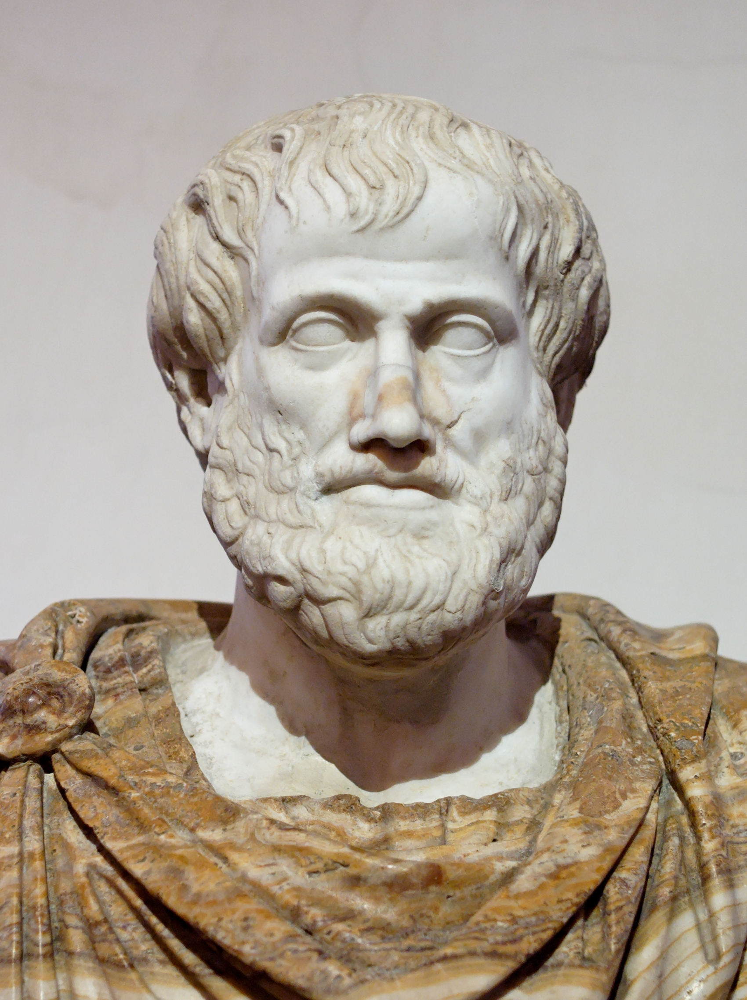
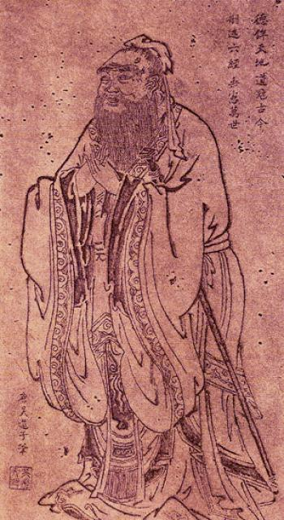

# Chapter 02: Technology and the Virtues

## Learning Outcomes

::: {.learning-outcomes}
By the end of this chapter, readers will be able to:

- Explain the core concepts of Aristotelian virtue ethics, including *eudaimonia* and the doctrine of the mean.
- Compare Aristotelian virtue with alternative traditions, including Buddhist, Confucian, and Care ethics.
- Apply virtue ethics to the design and use of modern information technology, including smartphones, social media, and AI.
- Evaluate arguments that commercial IT infrastructure actively degrades human virtue.
- Analyze liberal and Nietzschean criticisms of virtue ethics in the context of technology governance.
:::

## Essential Question

::: {.essential-question}
Does modern technology help us become better versions of ourselves, or does it erode the character traits required for a good life?
:::

## What does it mean to live a "Good Life"?

::: {.section-question}
Question: How does virtue ethics shift the moral focus from following rules to building habits?
:::

Most of the time, when people think about computing ethics or AI governance, they ask questions about rules: "Is it legal to scrape this data?" or "What are the company's guidelines on hate speech?" These are incredibly important questions, but they represent only one way of thinking about morality. An entirely different—and much older—approach asks not "What are the rules?" but rather "Who am I becoming?" This is the core of **virtue ethics**.

Virtue ethics is not concerned primarily with isolated actions or rigid commandments. Instead, it asks whether our environments, our communities, and our daily habits are molding us into excellent humans. While this concept appears in many global traditions, its most famous Western formulation comes from **Aristotle** in ancient Greece.

Virtue ethics is not concerned primarily with isolated actions or rigid commandments. Instead, it asks whether our environments, our communities, and our daily habits are molding us into excellent humans. While this concept appears in many global traditions, its most famous Western formulation comes from **Aristotle** in ancient Greece.

<figure>
  
  <figcaption>Marble bust of Aristotle. Roman copy after a Greek bronze original. National Roman Museum. Public domain (Wikimedia Commons).</figcaption>
</figure>

Aristotle argued that everything in the universe has a *telos*—a purpose or ultimate goal. The *telos* of an acorn is to become an oak tree. The *telos* of a knife is to cut sharply. What, then, is the *telos* of a human being? Aristotle answered that the ultimate goal of human life is ***eudaimonia***, often cheaply translated as "happiness," but much more accurately understood as "human flourishing," "thriving," or "living well." 

To reach *eudaimonia*, one must cultivate *arete*, which means "excellence" or "virtue." In the Aristotelian framework, virtues are excellent traits of character—like courage, honesty, temperance, and patience—that allow a person to navigate life's challenges well.

::: {.famous-figure}
**Aristotle (384–322 BCE)**

A towering figure of ancient Greek philosophy, a student of Plato, and the tutor of Alexander the Great. Aristotle's work laid the foundation for formal logic, biology, aesthetics, and ethics in the Western tradition.

> "The virtues we get by first exercising them, as also happens in the case of the arts as well. For the things we have to learn before we can do them, we learn by doing them... we become just by doing just acts, temperate by doing temperate acts, brave by doing brave acts."
>
> — Aristotle, *Nicomachean Ethics*, Book II (1103a-b)

*Key works:* *Nicomachean Ethics*, *Politics*, *Poetics*, *Metaphysics*

*Relevance to IT ethics:* Aristotle established the framework of virtue ethics, emphasizing that character is built purely through habitual action. Applied to tech, his ideas suggest that our daily digital habits—scrolling, posting, prompting AI—are a literal form of moral training that slowly but permanently shapes who we become.
:::

Crucially, Aristotle proposed that virtues are not inborn; they are acquired strictly through practice. Ethics is not like algebra, where you simply memorize a formula. It is more like learning to play the flute. You don't become a musician by reading a book; you become a musician by practicing scales. We become brave by doing brave things. 

Furthermore, Aristotle introduced the **doctrine of the mean**: a virtue is generally the sweet spot, or the "golden mean," between two opposing vices—one of excess and one of deficiency. For example:
- **Courage** is the mean between cowardice (deficiency) and recklessness (excess). 
- **Honesty** is the mean between deception (deficiency) and brutal, tactless bluntness (excess).
- **Temperance** is the mean between insensibility (deficiency) and overindulgence/addiction (excess).

To hit this target requires ***phronesis***, or "practical wisdom"—the ability to read a situation, understand context, and choose the right action at the right time. You cannot outsource *phronesis* to a rigid rulebook; you must develop it through lived experience. 

When we evaluate modern information technology through this lens, the conversation completely shifts. A virtue ethicist looking at a smartphone does not just ask "Is the software legally compliant?" They ask: "What habits is this device training its user to perform?"

If virtues are habits formed by repeated action, spending four hours a day swiping through short-form video in a highly reactive, perpetually distracted state is not a morally neutral activity. It is active, rigorous conditioning. 

<figure class="mermaid-figure">
  <pre class="mermaid">
flowchart LR
    A["Vice of Deficiency Isolation / Disconnection"] --> B(["Virtue: Healthy Connection"])
    C["Vice of Excess Enmeshment / Doomscrolling"] --> B
  </pre>
  <figcaption>Figure 1. The Aristotelian Doctrine of the Mean applied to digital connectivity.</figcaption>
</figure>

Consider algorithms designed to maximize "time on site" by surfacing enraging content. These platforms pull users forcefully toward the vices of excess—extreme anger, enmeshment, and distraction. Through the lens of virtue ethics, a badly designed app does not just waste a user's time. By repeatedly rewarding vicious habits, the technology actively makes the user a worse person. Similarly, if we constantly use GPS navigation without paying attention to our surroundings, we achieve our immediate goal—arriving at the destination—but sacrifice the opportunity to develop spatial *phronesis*. The tool performs the excellence so we don't have to.

This distinction between knowledge and habit is one of Aristotle's most counterintuitive insights, and it matters enormously for understanding how technology shapes us. Consider what happened to one of the people who built the tools in question.

::: {.case-study}
**Mini Case: The Like Button's Inventor**

In 2017, a former Facebook product manager named **Leah Pearlman**---one of the people who co-created the Facebook "Like" button---publicly admitted that she had developed a serious dopamine dependency on the likes she received on her own posts. She eventually hired a social media manager to handle her accounts because she no longer trusted herself to use her own invention without compulsively checking for validation.

This is precisely what Aristotle would call a failure of *phronesis*. Pearlman knew intellectually that compulsively refreshing for likes was not contributing to her flourishing. The knowledge was there. What was missing was the deeply cultivated *habit* of moderation that becomes automatic only through sustained practice.

Aristotle's insight here is counterintuitive: knowing what is good is not enough. You must *practice* choosing the mean in small, everyday situations until that moderate response becomes your natural, automatic reaction. A person who requires an external intervention to prevent compulsive use of their own product is in the same position as Aristotle's *akratic* person---someone whose intellectual judgment is correct, but whose habits are not yet strong enough to win the battle against impulse.

*What daily practices would help a person build the phronesis to use social media with genuine autonomy rather than compulsion?*
:::

::: {.discussion-questions}
**Discussion**

1. If you had to identify the "golden mean" of smartphone use, what would it look like in your daily life? How much is too little, and how much is too much?
2. Aristotle says we become brave by doing brave acts. If an AI assistant constantly writes uncomfortable emails or apologies for you, are you losing the capacity to practice courage?
3. Do you think tech companies have a moral obligation to help users achieve *eudaimonia*, or is character-building out of scope for a corporation?
:::

## Are there other ways to think about virtue?

::: {.section-question}
Question: How do Buddhist, Confucian, and Care ethics challenge or expand the Aristotelian idea of flourishing?
:::

While Aristotle provides the foundational language for Western virtue ethics, his framework has a significant limitation: it was built by and for a specific kind of person in a specific kind of society—a free Greek male citizen with the leisure to engage in civic life. When we compare his vision of flourishing to traditions from Asia and from feminist philosophy, we discover not just different lists of virtues, but fundamentally different answers to the question "What kind of creature is a human being, and what does it mean for one to thrive?" This matters for technology ethics because different answers generate radically different critiques of the same platform. 

**Buddhist Ethics** focuses extensively on the relief of suffering (*dukkha*). According to fundamental Buddhist teachings, suffering is the inevitable result of craving, clinging, attachment, and ignorance. To overcome this, practitioners cultivate specific states of character, centrally including ***sati***, commonly translated as **mindfulness**—the capacity to remain fully present, aware, and non-reactive in the current moment [@keown2001nature].

When applied to modern technology, a Buddhist ethical framework issues a devastating critique of the modern "attention economy." Platforms that rely on push notifications, infinite scrolling, variable reward gamification, and targeted outrage are essentially industrial engines designed to manufacture craving and attachment. They train the mind into a constant state of restless desire for the next hit of dopamine or social validation. From a Buddhist perspective, cultivating mindfulness in an ecosystem specifically engineered to shatter your attention is not just difficult; it requires resisting the fundamental architecture of the internet.

<figure>
  
  <figcaption>Portrait of Confucius by an unknown artist. Public domain (Wikimedia Commons).</figcaption>
</figure>

**Confucian Ethics** shifts the lens from the individual to the community entirely. Confucius placed a far stronger emphasis on relational harmony, community duty, and tradition than Aristotle's individualistic focus on personal excellence. For Confucius, human beings are fundamentally defined by their relationships---not by their private pursuit of a good life. Ethics revolves around concepts like ***ren*** (humaneness, benevolence, or deep empathy between people) and ***li*** (ritual propriety, etiquette, and protocol) [@confucius2003analects].

::: {.famous-figure}
**Confucius (551–479 BCE)**

A Chinese philosopher and politician whose teachings on personal and governmental morality, social relationships, and justice became the foundation of Chinese culture.

> "Guide them by edicts, keep them in line with punishments, and the common people will stay out of trouble but will have no sense of shame. Guide them by virtue, keep them in line with the rites (*li*), and they will, besides having a sense of shame, reform themselves."
>
> — Confucius, *Analects* (2.3)

*Key works:* *The Analects* (compiled by followers)

*Relevance to IT ethics:* Confucius emphasizes that morality is maintained through *li*—rituals and etiquette that structure our interactions. Digital platforms often actively strip away polite rituals to speed up interactions, which a Confucian warns will rapidly devolve into social chaos and toxicity.
:::

A Confucian approach to IT ethics would prioritize the health of the community and the preservation of respectful social rituals over individual free expression. The casual toxicity, flame wars, and harassment often enabled by online anonymity and rapid-fire replies are not just examples of individual rudeness. To a Confucian, they represent a catastrophic breakdown of *li*. Digital interfaces strip away the formal etiquette of real-world interaction, and when they do, what follows is predictable: users treat each other with cruelty, destroying the social fabric that allows a community to function at all.

Neither Aristotle nor Confucius, however, questioned a fundamental assumption shared by both: that the morally central unit is an individual (or a community of individuals) each pursuing their own flourishing or proper role. **Care Ethics**, emerging from feminist philosophy in the 20th century, questioned that assumption directly. Thinkers like Carol Gilligan and Nel Noddings argued that ethics begins not with an individual choosing a path to excellence, but with the fact that humans are born utterly dependent and remain interdependent for life. The basic unit of moral life, on this view, is not the agent pursuing a goal but the *relationship* between a vulnerable person and someone who cares for them [@noddings2013caring].

> "The caring relation is ethically basic... I must first be addressed, open and receptive, to the other."
>
> — Nel Noddings, *Caring: A Relational Approach to Ethics and Moral Education*

Care Ethics did not emerge from thin air. It was, in part, a direct response to what its founders saw as a systematic bias in how the moral mainstream had been defined—a bias that Carol Gilligan was the first to name rigorously.

::: {.famous-figure}
**Carol Gilligan (b. 1936)**

Carol Gilligan is an American psychologist and feminist ethicist best known for her landmark book *In a Different Voice* (1982), which fundamentally challenged the mainstream of moral psychology. The dominant theory of moral development---Lawrence Kohlberg's stage theory---had been built on studies of boys and men, scoring the abstract, rule-based reasoning it found in male subjects as the highest stage of moral maturity. Women, who reasoned in terms of relationships, context, and care, were systematically classified as morally immature.

Gilligan argued that this was not a deficiency in women's moral thinking but a different and equally valid moral framework: an **ethics of care**. Where Kohlberg's framework asked "What rule or principle applies here?", care ethics asks "Who will actually be hurt? What do I specifically owe to *this* person, given our relationship and their particular needs?"

*Key works:* *In a Different Voice* (1982), *Mapping the Moral Domain* (1988)

*Relevance to IT ethics:* Gilligan's framework challenges the design of AI systems that reduce caregiving to efficient transactions. When mental health chatbots dispense therapeutic responses "at scale," or when elderly care is delegated to robotic systems, the question Gilligan forces us to ask is not just "Does it achieve the goal?" but "Does this honor the irreplaceable particularity of one human being caring for another?" [@gilligan1982voice]
:::

From a Care Ethics perspective, technology becomes ethically troubling not primarily because it erodes individual virtues, but because it substitutes the appearance of relationship for the real thing. Genuine care requires friction; it requires recognizing the messy, demanding, and particular needs of a real human being in a specific moment. Systems that try to automate, scale, or outsource empathy miss what makes care morally significant in the first place. This concern is no longer hypothetical.

::: {.case-study}
**Mini Case: The AI Companion**

Millions of users now interact daily with AI chatbots like Replika or Character.ai, forming incredibly deep emotional attachments. For many lonely people, these systems provide vital comfort. They are programmed to always listen, never judge, and constantly validate the emotional state of the user. Because they are algorithms, they never get exhausted, they never get offended, and they never demand anything in return.

But evaluated through the lens of the traditions we have been exploring, this dynamic raises serious concerns from multiple directions. From an Aristotelian perspective, true friendship (*philia*) requires challenge and friction to help both parties grow in virtue. The AI never challenges you. From a Buddhist perspective, the chatbot is a machine for manufacturing attachment---a relationship designed specifically to generate the craving for its own continuation. From the perspective of Care Ethics, genuine care requires mutual vulnerability: it involves recognizing the fragile humanity of an imperfect other and taking on the burden of their needs in return. The chatbot has no needs. It has no vulnerability. It cannot be harmed by your indifference.

*Does an AI companion that never disagrees with you cultivate the virtue of empathy? Or does interacting with a perfectly subordinate digital servant build a habit of expecting relationships to serve you unconditionally---without demanding vulnerability or compromise in return?*
:::

These comparative traditions show us that evaluating technology requires asking *which* virtues we care about most. Are we trying to build independent, courageous individuals (Aristotle), mindful and unattached observers (Buddhism), harmonious and polite community members (Confucius), or deeply empathetic relational caregivers (Care Ethics)? A feature that looks like a neutral design choice---say, the ability to delete a message after sending it---looks very different through each of these lenses. If we build tools that optimize for one tradition's ideal, we may accidentally undermine another's.

::: {.discussion-questions}
**Discussion**

1. Which of these four traditions (Aristotelian, Buddhist, Confucian, Care) do you think best addresses the problems of modern social media?
2. If you were designing a social network on Confucian principles, how would you change the "reply" or "comment" features?
:::

## Do our devices make us shallow, isolated, and anxious?

::: {.section-question}
Question: How is commercial IT infrastructure actively changing human character?
:::

If we accept the premise that our tools shape our habits, and our habits shape our character, then the design of modern information technology is not just a business question---it is a profound moral one. A growing chorus of philosophers, psychologists, and cultural critics argue that the predominant business model of the internet---extracting attention to sell advertising---is structurally incompatible with cultivating human virtue. This is not a claim that individual tech executives are evil, or that any particular product was *designed* to harm its users. It is a claim about what happens when a system's goal is engagement above all else.

The philosopher Shannon Vallor has done more than anyone else to connect this critique directly to the virtue ethics tradition, arguing that what we urgently need now is not just better regulations but the cultivation of what she calls **technomoral virtues**: forms of character specifically suited to navigating a world saturated by powerful, algorithmically driven technology [@vallor2016technology].

::: {.famous-figure}
**Shannon Vallor (b. 1972)**

Shannon Vallor is a philosopher of technology at the University of Edinburgh whose book *Technology and the Virtues* (2016) is the most systematic contemporary attempt to apply virtue ethics to questions of technology design and use. Vallor argues that the dominant frameworks of tech ethics---utilitarian cost-benefit analyses and rights-based regulations---focus on isolated decisions rather than on the more fundamental question: what kind of people are we becoming as a result of our technological practices?

Vallor identifies a set of **technomoral virtues** specifically suited to life in a networked, algorithmically shaped world. These include *care* (genuine concern for those affected by technology, not just abstract rule compliance), *humility* (honest recognition of the limits of our knowledge about complex technological systems), *perspective* (the ability to see one's technology use in a broader human and historical context), and *technomoral wisdom* (the practical ability to navigate novel ethical situations for which no established rule yet exists).

> "The development of moral skill is... the task of ethical self-cultivation: actively, deliberately, and thoughtfully shaping in ourselves the practical wisdom to navigate a technologically complex world."
>
> --- Shannon Vallor, *Technology and the Virtues* (2016)

*Key works:* *Technology and the Virtues: A Philosophical Guide to a Future Worth Wanting* (2016)

*Relevance to IT ethics:* Vallor is the most important contemporary thinker connecting virtue ethics directly to technology design. Her framework draws on Aristotle, Confucianism, and Buddhism simultaneously---arguing that despite their differences, all three traditions point toward the same insight: our moral character is made, not merely declared, by the cumulative weight of our daily habits, including our digital ones.
:::

Vallor's broad diagnosis finds support across several fields, each pointing to a different virtue that current technology tends to erode:

- **The erosion of intellectual virtue:** Nicholas Carr has argued that search engines and hyperlinks rewire our brains, making us incredibly efficient at skimming information but degrading our capacity for deep reading, sustained concentration, and patience [@carr2011shallows].
- **The erosion of conversational virtue:** Sherry Turkle's research explores how smartphones—always present, always offering an escape—degrade our ability to be fully present with one another. We sacrifice deep, vulnerable conversations for the low-stakes, highly controlled environment of text messaging [@turkle2015reclaiming].
- **The erosion of psychological virtue:** Jonathan Haidt argues that the sudden shift to a "phone-based childhood" has deprived young people of the risk-taking, independent play, and synchronized social friction necessary to develop courage and resilience, leading directly to a crisis of anxiety [@haidt2024anxious].

::: {.argument}
**Argument: The Technological Erosion of Virtue**

**Standard Form:**

1. The continuous development of virtues (like patience, empathy, and courage) requires friction, delayed gratification, and social risk.
2. Commercial IT infrastructure (social media, AI assistants, search) is deliberately designed to remove friction, provide instant gratification, and insulate users from social risk.
3. Therefore, regular engagement with commercial IT infrastructure actively degrades the development of human virtue.

**Common Criticisms:**

- *Technological Determinism:* This argument often ignores human agency. People can choose to use these tools mindfully and set their own boundaries.
- *Blindness to new virtues:* While some traditional virtues may be challenged, technology allows for the cultivation of new virtues, such as global solidarity, rapid collaboration, and digital civic engagement.
- *Romanticizing the past:* Critics often view the pre-digital era with rose-tinted glasses, ignoring how traditional "friction" often isolated vulnerable or marginalized individuals who now find community online.
:::

| Traditional Virtue | Anti-Virtuous Design Feature | Resulting Digital Vice |
|---|---|---|
| Patience | Infinite scroll, instant page loads | Restlessness, immediate gratification |
| Courage / Risk-taking | Algorithmic filter bubbles | Echo chambers, ideological fragility |
| Empathy | Anonymity, metric-driven outrage | Trolling, dehumanization |
| Mindfulness | Push notifications, variable rewards | Perpetual distraction, continuous partial attention |

Table: How specific technical designs map to the erosion of traditional virtues.

These critiques bring virtue ethics down to the level of UX design. But perhaps the most troubling aspect of the situation is not that tech companies failed to notice the harm---it is that, in at least one major case, they noticed it and continued anyway.

::: {.case-study}
**Case Study: The Facebook Papers**

In October 2021, a former Facebook product manager named **Frances Haugen** leaked tens of thousands of internal documents to regulators and journalists. The documents---quickly dubbed the "Facebook Papers"---revealed that the company’s own researchers had extensively documented the harms its products caused. Internal studies showed that Instagram’s algorithms consistently made teenage girls feel worse about their bodies. The platform’s own data showed that algorithmically amplified outrage deepened political polarization while increasing engagement. In every case, executives were aware of these findings and chose engagement metrics over user wellbeing.

What makes the Facebook Papers particularly useful for virtue ethics is that they reveal the problem is not ignorance. The company knew its products were creating vices. The structural issue is that the company’s goal---maximizing time on platform to sell advertising---systematically incentivizes optimizing for the very vices (outrage, envy, compulsion) that generate interaction, even when the moral cost is fully understood.

From an Aristotelian perspective, a company structurally incapable of prioritizing users’ *eudaimonia* over quarterly engagement numbers is exhibiting institutional *akrasia*---knowing what is right and consistently choosing what is profitable instead. Shannon Vallor’s diagnosis applies pointedly: an industry that defines its mission as "connecting people" while internally documenting that it is making those people miserable is not just building bad products. It is, at industrial scale, manufacturing vice.

*Should tech companies be legally required to disclose internal research about harms caused by their algorithmic design? Or does this requirement miss a deeper structural problem---the business model itself?*
:::

## What is the danger of enforcing "the Good"?

::: {.section-question}
Question: Does designing technology to "make us virtuous" violate our fundamental freedoms?
:::

The obvious response to all of this seems clear: if technology is degrading our character, redesign technology to promote virtue. We could ban addictive infinite scrolls, force teenagers off platforms at bedtime, or require algorithms to promote calm, educational content over enraging content. The virtue-ethics case for such interventions is straightforward---if habits form character, and we can shape habits through design, then good design is a moral obligation.

But this move immediately runs into a powerful philosophical objection. The **liberal tradition**---in the classical philosophical sense, focused on individual liberty---argues that there is something deeply problematic about any authority deciding what a person's best self looks like and then engineering their environment to produce it. This objection was developed most precisely by Isaiah Berlin, whose own biography gave him strong personal reasons to take it seriously.

::: {.famous-figure}
**Isaiah Berlin (1909–1997)**

Isaiah Berlin was a Russian-born British philosopher and historian of ideas who became one of the most influential liberal thinkers of the twentieth century. Born in Riga, Latvia, he fled the Russian Revolution as a child and eventually became a professor at Oxford. Having watched both Nazism and Stalinism justify the destruction of individual freedom in the name of making people "truly free" or "historically fulfilled," Berlin was deeply suspicious of any political project that claimed to know what human beings "really" needed to flourish.

> "The criterion of oppression is the part that I believe to be played by other human beings, directly or indirectly, with or without the intention of doing so, in frustrating my wishes."
>
> --- Isaiah Berlin, *Two Concepts of Liberty* (1958)

In his landmark essay *Two Concepts of Liberty* (1958), Berlin distinguished **negative liberty** (freedom *from* interference---the absence of obstacles placed by others in your path) from **positive liberty** (freedom *to* achieve self-mastery or fulfill one's authentic potential). The danger, he argued, is that governments---and institutions generally---have historically justified eliminating negative liberty in the name of promoting positive liberty: "We are restricting your choices to make you truly free."

*Key works:* *Two Concepts of Liberty* (1958), *The Hedgehog and the Fox* (1953), *Four Essays on Liberty* (1969)

*Relevance to IT ethics:* Berlin's distinction maps directly onto debates about paternalistic tech regulation. When Apple's Screen Time feature limits how long teenagers can use Instagram "for their wellbeing," is it promoting positive liberty (helping them become their best selves) or violating negative liberty (treating autonomous people as incapable of making their own decisions)? Berlin's framework suggests we should be skeptical of any institution---government, platform, or AI system---that claims to know better than individual users what their flourishing requires.
:::

Berlin’s distinction is especially important because it exposes a real tension between virtue ethics and liberalism [@berlin1969two]. Virtue ethics is fundamentally committed to positive liberty: it has a substantive vision of what *eudaimonia* looks like and wants to arrange society---including technology---to help people achieve it. Berlin warns that every time someone says "we are restricting your choices to make you truly free," history produces a catalog of catastrophic results.

Applied to technology, the liberal critique asks: *Who gets to decide what counts as virtuous digital life?* Do we really want governments or tech monopolies deciding what content builds character? According to classical liberals, the state’s only legitimate role is to protect negative liberty---to prevent users from directly harming one another, in the tradition of Mill’s harm principle from Chapter 1. Designing users’ souls is not on the list. The liberal suspicion extends to the platforms themselves: an algorithm that demotes "divisive" content and promotes "healthy" content is making normative judgments about what kind of person you should become, whether it announces that intention or not.

::: {.discussion-questions}
**Discussion**

1. If a social media company implements a mandatory "bedtime" shutdown for teenage users to enforce healthy sleep habits, is this a praiseworthy cultivation of virtue or an unacceptable violation of negative liberty?
2. Can a technology ever be truly "neutral" regarding character, or is it always making us better or worse?
:::

## Are the "virtues" just tools for conformity?

::: {.section-question}
Question: What if the things we call "virtues" are actually just control mechanisms?
:::

The liberal critique of virtue ethics accepts the framework but worries about who applies it. There is a more radical challenge---one that rejects the framework itself. The 19th-century German philosopher **Friedrich Nietzsche** argued that what a society calls "virtue" is rarely a neutral description of human excellence. It is almost always a tool of power.

::: {.famous-figure}
**Friedrich Nietzsche (1844--1900)**

A profound and controversial German philosopher known for his critique of traditional religion, morality, and culture. His ideas deeply influenced existentialism, modern psychology, and postmodernism.

> "What is good?---All that heightens the feeling of power in man, the will to power, power itself. What is bad?---All that is born of weakness."
>
> --- Friedrich Nietzsche, *The Antichrist* (1895)

*Key works:* *On the Genealogy of Morality*, *Beyond Good and Evil*, *Thus Spoke Zarathustra*

*Relevance to IT ethics:* Nietzsche argued that much of what society calls "virtue" is actually "herd morality"---rules designed by the weak to keep the strong and creative in check. In the tech context, his thought challenges whether "safe," "aligned," and "friendly" AI really just translates to "sterile," "predictable," and "mediocre."
:::

Nietzsche completely rejected the Aristotelian idea of an objective, universal path to flourishing. He argued that throughout history, different classes have invented moralities to serve their own interests. Most profoundly, he diagnosed traditional Western morality (heavily influenced by Christianity) as **herd morality**. "Virtues" like meekness, patience, self-sacrifice, and equality were, in his view, mechanisms invented by the weak to tame the exceptional, to make humans predictable, harmless, and easy to govern [@nietzsche1998genealogy].

A Nietzschean critique of modern technology—particularly Artificial Intelligence—is radically different from the others we have explored. When tech companies talk about "AI Alignment," "Trust and Safety," or making sure AI is "helpful, honest, and harmless," a Nietzschean would ask: *Helpful to whom? Harmless to what?* 

From this view, the massive corporate efforts to align AI with human "values" are just modern attempts to enforce herd morality. By making AI polite, cautious, and universally inoffensive, we might be neutralizing its potential to be truly disruptive, creative, or great. We are programming chatbots to speak with the bland, bureaucratic voice of an HR department, terrified of taking risks or articulating dangerous but necessary artistic truths. 

While few people identify entirely as Nietzscheans today, this critique hits a raw nerve in the modern AI debate. It forces us to confront whether our obsession with "safety," "digital wellness," and "virtue" is actually about human flourishing, or if it is merely a desire for predictability, control, and conformity.

Nietzsche’s critique, bracing as it is, may miss something important. Both he and Berlin focus on what happens when authority imposes conformity---Nietzsche fears the suppression of greatness, Berlin fears the violation of freedom. Neither fully addresses a third danger: not the suppression of excellence, not the violation of freedom, but the *erasure of moral judgment itself*.

We met **Hannah Arendt** in Chapter 1 when examining mass media and totalitarianism. Her concept of the **banality of evil**---developed from her coverage of the 1961 trial of Adolf Eichmann, an ordinary bureaucrat who helped administer the Holocaust not out of sadism but through a complete absence of moral reflection about what he was actually doing---applies here with equal force [@arendt1963eichmann]. Nietzsche worries that conformity suppresses greatness; classical liberals worry that conformity suppresses freedom. Arendt adds a third worry: systems designed to *remove* the need for moral judgment---by automating decisions, optimizing for measurable metrics, and replacing *phronesis* with policy---can produce harm at industrial scale with no individual villains. When a content moderation algorithm flags thousands of accounts for removal and a human employee simply approves the batch without reviewing them, who is exercising moral judgment? Offloading judgment to automated systems is not a neutral efficiency gain. It is a moral choice, and one with a dangerous historical track record.

## Discussion Questions

::: {.discussion-questions}
1. Should schools use web-filtering software to block distracting websites to help students build the virtue of focus, or does that deprive students of the chance to practice self-control in the face of real temptation?
2. Aristotle believed virtues are built through practice. If a generative AI writes polite, empathetic-sounding emails on your behalf, are you becoming more empathetic, or are you losing the capacity to express empathy yourself?
3. How would Isaiah Berlin (the classical liberal) and Friedrich Nietzsche respond differently to a government proposal to ban algorithmic infinite-scrolling feeds?
4. Hannah Arendt argued that great harm can emerge from ordinary people who follow procedures without exercising moral judgment. Does that describe any AI-related practices you are familiar with? Who, if anyone, is exercising moral judgment in those cases?
:::

## Summary

::: {.chapter-summary}
Virtue ethics approaches technology by asking not what the rules are, but how our tools shape our character and habits. Traditions from Aristotle to Buddhism to Care Ethics offer different visions of human flourishing, but they share the belief that our environment actively trains us to be certain kinds of people. Critics argue that commercial IT infrastructure, designed to maximize engagement and remove friction, systematically degrades intellectual, conversational, and psychological virtues. However, using technology to enforce "virtuous" behavior raises serious philosophical pushback. Classical liberals (Berlin) warn that paternalistic tech design violates negative liberty by imposing one group's vision of the "good life" on everyone. More radically, Nietzschean critics suggest that efforts to make algorithms "safe" and "virtuous" are ways to enforce conformity and suppress disruptive greatness. Hannah Arendt adds a third warning: the deeper danger may not be the suppression of excellence or the violation of freedom, but the elimination of moral judgment itself---designing systems that automate ethical decisions and allow ordinary people to participate in harm without malice or even awareness. Judging the ethics of technology requires us to decide not only what kind of people we want to become, but who---if anyone---remains responsible for the decisions our systems make.
:::
